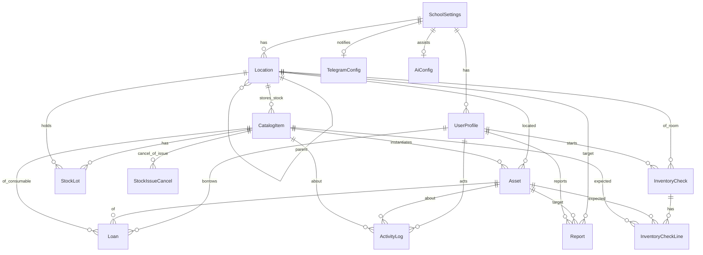

# inni Domain Model (ERD)

단일 학교 인스턴스.  
**구현:** SQLite (`sql/schema.sql`, `data/inni.sqlite`). 아래 이름은 논리 모델이며 테이블명은 snake_case로 매핑된다.  
사진 파일은 DB가 아니라 `public/uploads/`에 저장하고 경로만 보관한다.

## Collections

### `settings/school` (singleton)
| Field | Type | Notes |
|-------|------|-------|
| name | string | 학교명 |
| logoUrl | string? | |
| allowedEmailDomains | string[] | 예: `["school.go.kr"]`, 비어 있으면 제한 없음 |
| timezone | string | 기본 `Asia/Seoul` |
| labelDefaults | object | QR size, paper preset id |
| updatedAt | timestamp | |

### `users/{uid}`
| Field | Type | Notes |
|-------|------|-------|
| email | string | |
| displayName | string | |
| photoURL | string? | |
| role | `owner` \| `manager` \| `teacher` \| `student` | student는 Phase3 |
| status | `pending` \| `active` \| `disabled` | |
| telegramChatId | string? | 개인 DM용 |
| createdAt | timestamp | |
| updatedAt | timestamp | |

### `locations/{id}`
계층: building → room → zone → storage → bin (`kind`)

| Field | Type | Notes |
|-------|------|-------|
| name | string | |
| kind | `building` \| `room` \| `zone` \| `storage` \| `bin` | |
| parentId | string \| null | |
| path | string[] | 조상 id 목록 (쿼리용) |
| pathNames | string[] | 표시용 |
| code | string? | 실 코드 |
| managerIds | string[] | users uid |
| notes | string? | |
| sortOrder | number | |
| qrCode | string | 스캔 값 `LOC:{id}` |
| createdAt, updatedAt | timestamp | |

**Room**은 `kind=room`인 location. UI에서 1급.

### `catalogItems/{id}`
품목(종류). 소모품/비품/부품은 주로 여기 + stockLots.

| Field | Type | Notes |
|-------|------|-------|
| name | string | |
| type | `equipment` \| `fixture` \| `consumable` \| `part` | |
| description | string? | |
| categoryIds | string[] | |
| tags | string[] | |
| unit | string | 기본 `ea` |
| minStock | number? | consumable/part |
| edufineNumber | string? | 옵션 |
| manufacturer | string? | |
| budgetProgram | string? | 구입 사업명 (자유 입력) |
| budgetYear | number? | YYYY |
| imageUrl | string? | |
| qrCode | string | `CAT:{id}` |
| favorite | boolean | |
| createdAt, updatedAt | timestamp | |

### `assets/{id}`
개체 추적 장비 (equipment 위주). 1물품 1문서.

| Field | Type | Notes |
|-------|------|-------|
| catalogItemId | string | |
| name | string | 표시명 (보통 catalog와 동일 + 구분) |
| managementNumber | string | 학교 관리번호, unique |
| serialNumber | string? | |
| edufineNumber | string? | |
| status | `available` \| `on_loan` \| `repair` \| `moving` \| `lost` \| `retired` | |
| locationId | string | 현재 위치 |
| tags | string[] | |
| imageUrl | string? | |
| purchaseDate | string? | ISO date (UI: 도입일) |
| usefulLifeYears | number? | 내용연한(년). 만료 예정일 = purchaseDate + years |
| budgetProgram | string? | 구입 사업명 (자유 입력) |
| budgetYear | number? | YYYY |
| notes | string? | |
| qrCode | string | `AST:{id}` 또는 관리번호 |
| createdAt, updatedAt | timestamp | |

### `stockLots/{id}`
비품·소모품·부품의 위치별 수량.

| Field | Type | Notes |
|-------|------|-------|
| catalogItemId | string | |
| locationId | string | |
| quantity | number | |
| updatedAt | timestamp | |

Unique: `(catalogItemId, locationId)`

### `loans/{id}`
| Field | Type | Notes |
|-------|------|-------|
| kind | `asset` \| `consumable` | |
| assetId | string? | kind=asset |
| catalogItemId | string? | kind=consumable |
| quantity | number | consumable만 |
| borrowerUid | string? | 로그인 사용자 |
| borrowerName | string | 메모/표시 (학생 이름 등) |
| borrowerNote | string? | 학번 등 |
| fromLocationId | string? | |
| dueAt | timestamp? | |
| returnedAt | timestamp? | |
| status | `active` \| `returned` \| `overdue` | |
| purpose | string? | |
| createdAt | timestamp | |
| createdBy | string | uid |

### `stock_issue_cancels/{id}`
사용 출고(`activity_logs.action=issue`) 1건당 취소 0~1건. UNIQUE(`issue_log_id`).

| Field | Type | Notes |
|-------|------|-------|
| issueLogId | string | 원 출고 activity_logs.id |
| catalogItemId | string | |
| lotId | string | 복원할 stock_lots.id |
| locationId | string | |
| quantity | number | 복원 수량(양수) |
| reason | string | 취소 사유 |
| actorUid | string? | |
| actorName | string | |
| createdAt | timestamp | |

### `activityLogs/{id}`
| Field | Type | Notes |
|-------|------|-------|
| action | string | `create` `update` `loan` `return` `move` `issue` `restock` `cancel_issue` `retire` `report` … |
| entityType | `asset` \| `catalog` \| `location` \| `loan` \| `report` | |
| entityId | string | |
| actorUid | string | |
| actorName | string | |
| summary | string | 한국어 한 줄 |
| meta | map | before/after 등 |
| createdAt | timestamp | |

### `inventory_checks/{id}` (P1 가벼운 실사)
한 시점에 진행 중(`status=active`) 세션은 1건. 이어하기·텔레그램·엑셀은 범위 밖.

| Field | Type | Notes |
|-------|------|-------|
| locationId | string | 선택한 실(`kind=room`) |
| locationName | string | 시작 시점 실 이름 |
| status | `active` \| `done` | UNIQUE partial: active 1건 |
| startedBy | string | owner/manager |
| startedAt, finishedAt | timestamp | |

### `inventory_check_lines/{id}`
실 + 하위 위치의 장비·재고 스냅샷. 스캔/코드 입력으로 `confirmedAt`만 채운다(수량 변경 없음).

| Field | Type | Notes |
|-------|------|-------|
| checkId | string | |
| kind | `asset` \| `item` | |
| assetId | string? | kind=asset |
| catalogItemId | string? | kind=item |
| stockLotId | string? | kind=item |
| locationId | string | 예상 위치 |
| name, code | string | 표시·스캔 매칭 |
| expectedQty | number | 장비=1, 품목=로트 수량 |
| confirmedAt | timestamp? | |
| confirmedBy | string? | |

### `reports/{id}` (Phase3 스키마 선반영)
| Field | Type | Notes |
|-------|------|-------|
| targetType | `room` \| `asset` | |
| targetId | string | locationId or assetId |
| reporterUid | string? | |
| reporterName | string | |
| title | string | |
| body | string | |
| photoUrls | string[] | |
| status | `open` \| `in_progress` \| `done` | |
| createdAt, updatedAt | timestamp | |

### `categories/{id}`
| Field | Type | Notes |
|-------|------|-------|
| name | string | |
| parentId | string \| null | |
| path | string[] | |
| sortOrder | number | |

### `settings/telegram`, `settings/ai`
| telegram | botToken (서버 only), defaultChatId, events[] |
| ai | provider `openai`\|`upstage`\|`ollama`, baseUrl?, model?, enabled |

민감 키는 Firestore가 아니라 **환경변수 / Secret Manager** 권장. 클라이언트에는 enabled·provider 이름만.

## Indexes (필요)

- `assets`: locationId + status, managementNumber ASC, status + updatedAt
- `catalogItems`: type + name, tags (array-contains)
- `loans`: status + dueAt, borrowerUid + status, assetId + status
- `stockLots`: locationId, catalogItemId
- `activityLogs`: entityId + createdAt DESC, createdAt DESC
- `stock_issue_cancels`: catalogItemId + createdAt, issueLogId UNIQUE
- `locations`: kind + name, parentId + sortOrder
- `reports`: status + createdAt, targetType + targetId
- `inventory_checks`: status UNIQUE WHERE active
- `inventory_check_lines`: checkId + confirmedAt, (checkId, assetId) UNIQUE, (checkId, stockLotId) UNIQUE

## QR payload convention

| Prefix | Entity |
|--------|--------|
| `AST:` | asset |
| `CAT:` | catalog item |
| `LOC:` | location |

스캔 시 prefix로 라우팅.

## Role → capability (요약)

| | owner | manager | teacher | student |
|--|:-----:|:-------:|:-------:|:-------:|
| 읽기(목록/실) | ✓ | ✓ | ✓ | ✓(제한) |
| 등록/수정 | ✓ | ✓ | △ | |
| 대여/반납 | ✓ | ✓ | ✓ | 본인 |
| 실사/폐기 | ✓ | ✓ | | |
| 사용자 승인 | ✓ | | | |
| 설정·텔레그램·AI | ✓ | | | |
